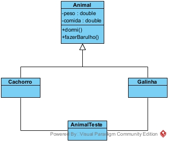

## Objeto Animais

 Um formato de objeto mais mostrado em Livros de engenharia de Software, como por exemplo o UML2

<ul>
  <li><a href="ObjetosAnimais/ObjetosAnimais-main/Animal.java">Animal</a></li>
  <li><a href="ObjetosAnimais/ObjetosAnimais-main/AnimalTeste.java">Animal Teste</a></li>
  <li><a href="ObjetosAnimais/ObjetosAnimais-main/Cachorro.java">Cachorro</a></li>
  <li><a href="ObjetosAnimais/ObjetosAnimais-main/Galinha.java">Galinha</a></li>
</ul>

## Cachorro

Neste código simples criei um objeto que seria um cachorro, e imprimi o seu comportamento como por exemplo: Latir

<ul>
  <li><a href="Cachorro_Instancia/Cachorro_Instancia-main/Cachorro.java">Cachorro</a></li>
  <li><a href="Cachorro_Instancia/Cachorro_Instancia-main/CachorroTeste.java">Cachorro Teste</a></li>
</ul>

## Conta Bancária

 Este código feito em Java, é a representação de uma conta Bancária, simulando situações como saque ou depósito

<ul>
  <li><a href="Objeto_Conta\Objeto_Conta-main/Conta.java">Conta</a></li>
  <li><a href="Objeto_Conta\Objeto_Conta-main/ContaTeste.java">Conta Teste</a></li>
</ul>

## Matemática

 Um código simples de orientação a objetos, criado com um intuito de me aprofundar neste formato de programação, a idéia era justamente simular operações matemáticas

<ul>
  <li><a href="Matematica/Matematica_Interacao_De_Classe-main/Matematica.java">Matematica</a></li>
  <li><a href="Matematica/Matematica_Interacao_De_Classe-main/MatematicaTeste.java">Matematica Teste</a></li>
</ul>
