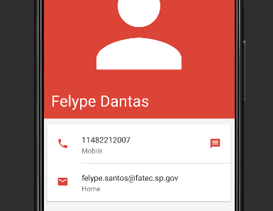

### Sistemas Operacionais 1

 Está matéria é lecionada pelo professor Leandro Colevati na Fatec Zona Leste, aonde foi ensinado fora o teórico de Sistemas operacionais como o Linux, Unix e Windows, alguns conteúdos importantes para SO´s como:

<ol>
  <li>Processos</li>
  <li>Threads</li>
  <li>Semaphoros</li>
  <li>Sistema de Arquivos</li>
  <li>Android</li>
</ol>

 Para mostrar o que aprendi em processos, subi na pasta <a href="inicia_AndroidStudio/AulaProcessos/src">inicia_AndroidStudio</a>, uma aplicação que inicia a IDE do android studio caso esteja em sua máquina em Downloads.

Com relção a Threads e semaphoros encontrarão o exemplo na pasta <a href="Carros/semaforo/src">Carros.</a>

 <a href="Android_Binario/main/java/com/example/prep3/MainActivy.java">Android Binário</a>, foi a minha última prova, a idéia era criar um aplicativo android que converte-se um valor para Binário

A última pasta foi uma foto que o professor pediu para subir com um contato aleatório no Android Studio

