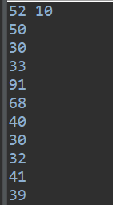
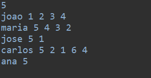
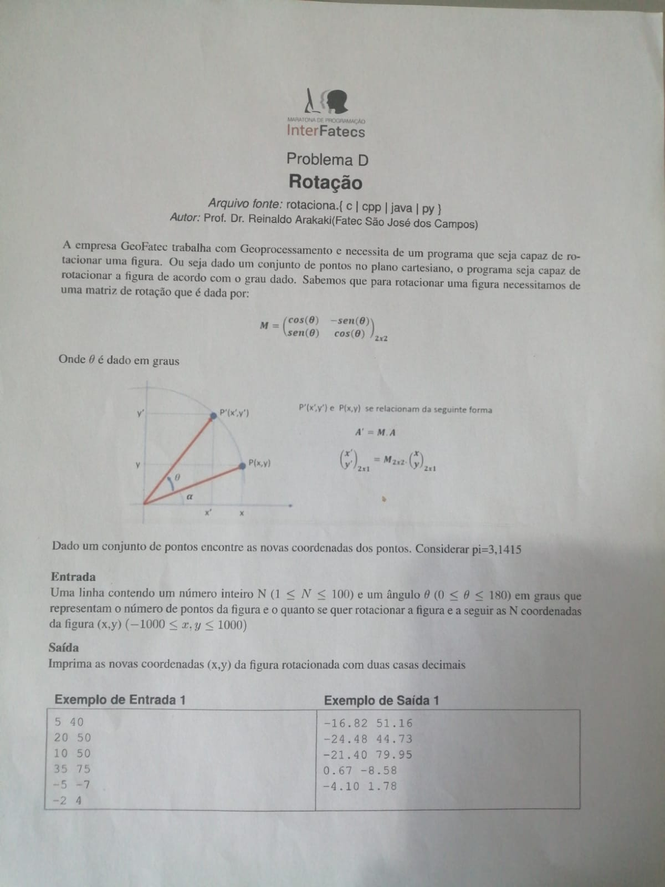
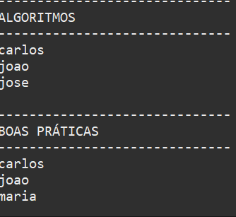

#### Problema B
## Teclado

 Neste exercicio foi preciso criar um código em que ao digitar as letras de um teclado de ligação de smartphone, ele retornasse os números correspondentes. <a href="teclado/teclado.java">clique aqui para ver o código</a>

#### Problema C
## Calcetis

 Embalado por um movimento crescente de investimento em startups orientais, o neto de Munarinho, Tikomo Nakama, decidiu abrir uma startup. Calcetis com a ideia de vender calcinhas usadas por musas de cinema. televisão e redes sociais.

Ele está em uma etapa importante do desenvolvimento em que precisa sugerir novos produtos aos compradores que já tem produtos no carrinho de compras. A idéia é que o valor do carrinho some R$200,00, para que o comprador tenha a opção de não pagar o frete. Por uma questão de simbologia oriental, que trará sorte para a startup, Nakama deseja ofertar exatamente 3 produtos diferentes que somem, juntos aos produtos do carrinho, exatamente o valor necessário, caso seja possivel. <a href="Calcetis/calcetis.java">Clique aqui para ver o código</a>

### Exemplo de entrada

### exemplo de saida

(Podendo conter duas saidas possiveis)

### Problema G 
## Plantão de dúvidas

<a href="plantaoduvidas/plantaoduvidas.java">Clique aqui para ver o código</a>

<h3>Tipo de entrada</h3>

## Matriz de rotação

<h3>Tipo de Saida</h3>

## Mentirinha

 Neste exercicio deveriamos criar uma forma de falar se o número era primo ou não. <a href="mentirinha/mentirinha.java">Clique aqui para ver o código</a>

## Quem é o pivô?

 Um exercicio simples procurando descobrir quem era o número do meio ou seja, recebia 3 valores, concatenava, e então pegava o do meio. <a href="Quem_e_o_pivo/main/pivo.java">Clique para ver o código</a>

## Autor

<a href="https://www.linkedin.com/in/felype-dantas-dos-santos-94497b193?utm_source=share&utm_campaign=share_via&utm_content=profile&utm_medium=android_app">

  
 <b>Felype Dantas Dos Santos</b></a> 

Feito por Felype Dantas Dos Santos 👨🏻‍💻 Entre em contato!

